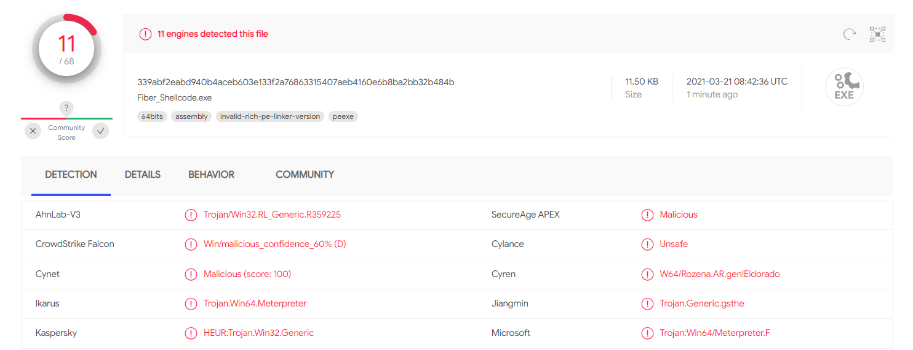

# Fiber_Injection
A simple tool to use windows Fibers to execute shellcode in a local process.

Features:
- Dynamic API resolution for bypassing static analysis
- Using Fiber API calls instead of famous monitored injection APIs like CreateRemoteThread
- Low detection rate on VT (Not detected by Symantec,ESET,Avira etc. )

How to Use:
1. Put your shellcode in the shellcode variable
2. Compile the Code
3. Execute it by CMD or PowerShell

